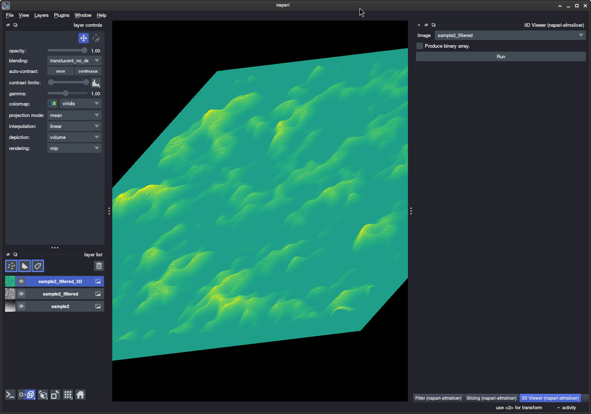

# napari-afmslicer

[](https://github.com/AFM-SPM/napari-afmslicer/raw/main/LICENSE)
[](https://pypi.org/project/napari-afmslicer)
[](https://python.org)
[](https://github.com/AFM-SPM/napari-afmslicer/actions)
[](https://codecov.io/gh/AFM-SPM/napari-afmslicer)
[](https://napari-hub.org/plugins/napari-afmslicer)
[](https://napari.org/stable/plugins/index.html)
[](https://github.com/copier-org/copier)

A simple plugin to use [AFMSlicer] with [napari]

----------------------------------

This [napari] plugin was generated with [copier] using the [napari-plugin-template].

## Installation

### Virtual Environments

`napari-afmslicer` is developed using the [uv] package manager and it is recommended as a fast and simple to use tool
for creating and managing virtual environments.

``` bash
cd ~/path/to/work
mkdir afmslicer-work
cd afmslicer-work
uv venv

```

### Installation from PyPI

**NB** Currently napari-afmslicer is _not_ yet available on PyPI and can not be installed from it using [pip].

<!-- You can install `napari-afmslicer` via [pip]: -->

<!-- ``` bash -->
<!-- pip install napari-afmslicer -->
<!-- ``` -->

<!-- If [napari] is not already installed, you can install `napari-afmslicer` with [napari] and Qt via: -->

<!-- ``` bash -->
<!-- pip install "napari-afmslicer[all]" -->
<!-- ``` -->

<!-- To install latest development version : -->

<!-- ``` bash -->
<!-- pip install git+https://github.com/AFM-SPM/napari-afmslicer.git -->
<!-- ``` -->

### Installation from Napari

**NB** Currently as napari-afmslicer is _not_ yet available on PyPI it can not be installed via the plugins menu in
Napari.

### Git Clone

You can clone and install the `napari-afmslicer` within the virtual environment of your choice. First clone the repository

``` bash
git clone git@github.com:AFM-SPM/napari-afmslicer.git   # If you have SSH keys configured on GitHub
git clone https://github.com/AFM-SPM/napari-afmslicer.git # If you don't have SSh keys configured on GitHub
```

Then install it within a virtual environment, the following creates a [uv] environment within the clone directory and
installs all plugins and developer optiosn

``` bash
cd napari-afmslicer
uv venv
uv sync
uv pip install -e .[extra,all] --group dev
```

## Usage

Once installed you can launch `napari` from the command line.

``` bash
napari
```

The resulting widgets implemented in this package can be found under the _Plugins > AFMSlicer_ menu. Selecting each
brings up a "widget" on the right hand side of the window (by default). There are the following widgets.

- AFMSlicer 3D Viewer
- AFMSlicer Filtering
- AFMSlicer Slicing

From each of the widgets configuration options can be toggled that change the settings for running/processing the
image. Clicking on the _Run_ button at the bottom of any of these should result in a new Layer being displayed in Napari
that show the effects of processing the selected image.

You can optionally start all napari AFMSlicer widgets with the following...

``` bash
napari -w napari-afmslicer __all__
```

The screenshot below shows a 3D view of a scan. and the widget tabs for filtering and slicing are on the bottom right of
the screen.



### Additional Plugins

Because AFMSlicer uses some of the functionality of [TopoStats][topostats] the [napari-TopoStats] and [napari-AFMReader]
plugins are included as a dependency and installed when napari-AFMSlicer is installed.

There are a lot of [napari plugins] available though, some of which are particularly useful for the AFMSlicer
workflow. These will be installed if you use the optional dependency group `extra` when installing `napari-afmslicer`

``` bash
uv pip install -e ".[extra]"
```

After launching Napari you will find these plugins listed under the "_Plugin_" menu.

The additional plugins that will be installed are...

- [napari-crop]
- [napari-plot-profile]
- [napari-segment-blobs-and-things-with-membranes]
- [napari-skimage]

**NB** - If you encounter problems with these plugins please report them up-stream at the GitHub repository for the
plugin rather than here.

## Contributing

Contributions are very welcome. Tests can be run with [tox], please ensure the coverage at least stays the same before
you submit a pull request.

## License

Distributed under the terms of the [GNU GPL v3.0] license, "napari-afmslicer" is free and open source software

## Issues

If you encounter any problems, please [file an issue] along with a detailed description.

[AFMSlicer]: https://github.com/AFM-SPM/AFMSlicer/
[napari]: https://github.com/napari/napari
[copier]: https://copier.readthedocs.io/en/stable/
[GNU GPL v3.0]: http://www.gnu.org/licenses/gpl-3.0.txt
[napari-plugin-template]: https://github.com/napari/napari-plugin-template

[file an issue]: https://github.com/AFM-SPM/napari-afmslicer/issues

[tox]: https://tox.readthedocs.io/en/latest/
[pip]: https://pypi.org/project/pip/
[topostats]: https://github.com/AFM-SPM/TopoStats
[napari-AFMReader]: https://github.com/AFM-SPM/napari-AFMReader
[napari-crop]: https://github.com/biapol/napari-crop
[napari-plot-profile]: https://github.com/haesleinhuepf/napari-plot-profile
[napari-segment-blobs-and-things-with-membranes]: https://github.com/haesleinhuepf/napari-segment-blobs-and-things-with-membranes
[napari-skimage]: https://github.com/guiwitz/napari-skimage
[napari-TopoStats]: https://github.com/AFM-SPM/napari-TopoStats
[uv]: https://docs.astral.sh/uv/
